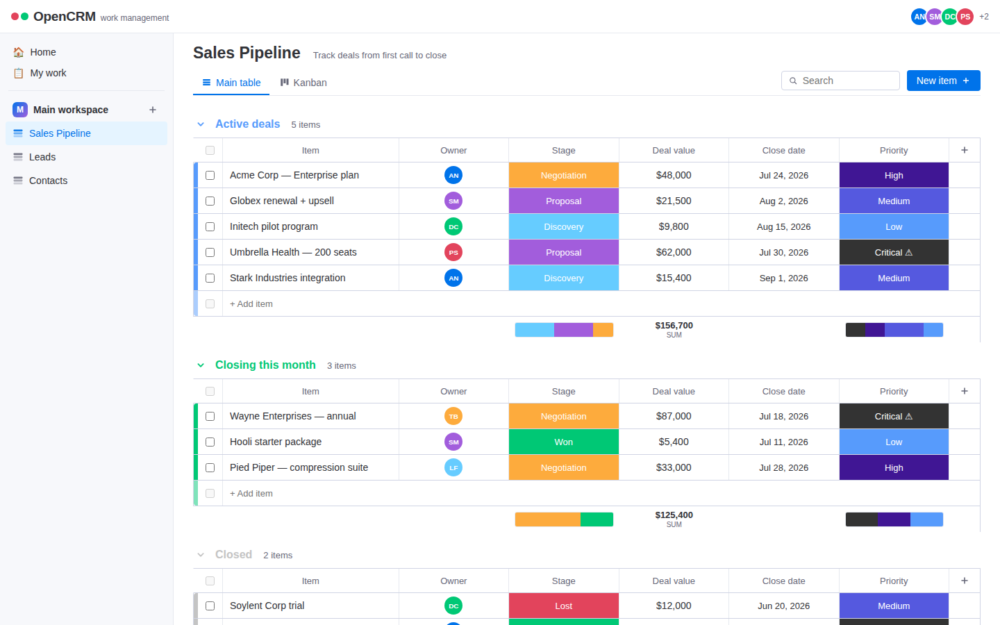

# OpenCRM

An open-source CRM with a monday.com-style board interface. Built with React and Node.js.



## Features

- **Boards** — organize your pipeline into boards (Sales Pipeline, Leads, Contacts out of the box)
- **Groups & items** — colored, collapsible groups of rows, just like monday.com
- **Column types** — status, priority, people, date, numbers, and text
- **Inline editing** — click any cell to edit; status and people cells open pickers
- **Group summaries** — status distribution strips and number-column sums per group
- **Kanban view** — drag cards between status lanes
- **Search** — filter items across the current board
- **Persistence** — a simple JSON-file datastore behind a REST API

## Stack

| Layer    | Tech                              |
| -------- | --------------------------------- |
| Frontend | React 18 + Vite                   |
| Backend  | Node.js + Express                 |
| Storage  | JSON file (`server/data/db.json`) |

## Getting started

```bash
npm install
npm run dev
```

- Client (Vite dev server): http://localhost:5173
- API: http://localhost:4000

The client dev server proxies `/api/*` to the API.

### Production

```bash
npm run build   # builds the client into client/dist
npm start       # serves API + built client on http://localhost:4000
```

The database seeds itself with demo data on first run. Delete `server/data/db.json` to reset.

## API overview

| Method | Path                                     | Purpose                    |
| ------ | ---------------------------------------- | -------------------------- |
| GET    | `/api/boards`                            | List boards                |
| POST   | `/api/boards`                            | Create board               |
| GET    | `/api/boards/:id`                        | Full board (groups, items) |
| PATCH  | `/api/boards/:id`                        | Rename board               |
| DELETE | `/api/boards/:id`                        | Delete board               |
| POST   | `/api/boards/:id/groups`                 | Add group                  |
| PATCH  | `/api/boards/:id/groups/:gid`            | Rename/collapse group      |
| POST   | `/api/boards/:id/groups/:gid/items`      | Add item                   |
| PATCH  | `/api/boards/:id/items/:iid`             | Rename item / set values   |
| POST   | `/api/boards/:id/items/:iid/move`        | Move item between groups   |
| POST   | `/api/boards/:id/columns`                | Add column                 |
| POST   | `/api/integrations/call-log`             | Log a call from the dialer |
| GET    | `/api/contacts`                          | Flat contact list (sync)   |
| GET    | `/api/analytics/calls`                   | Aggregated call stats      |

## Dialer integration

The CRM Dialer companion app posts each completed call to
`POST /api/integrations/call-log`. On the first call, a **Calls** board is
created automatically; every call is appended as an item (contact name, phone,
direction, outcome, duration, agent, AI summary, and date).

The request body is the dialer's `CrmPayload`:

```jsonc
{
  "event": "call_logged",
  "api_key": "…",                    // may be sent here or as a Bearer header
  "user_profile":   { "agent_name": "…", "agent_role": "…", "agent_company": "…", "agent_phone": "…" },
  "call_details":   { "phone_number": "+1…", "direction": "OUTGOING", "duration_seconds": 183,
                      "timestamp": 1752000000000, "status": "COMPLETED", "has_recording": true,
                      "local_recording_path": "…" },
  "contact_identification": { "name": "…", "company": "…", "role": "…", "email": "…", "notes": "…" },
  "ai_insights":    { "transcript": "…", "summary": "…" }
}
```

Only `call_details.phone_number` is required.

**Idempotency.** If the dialer includes a stable `call_details.external_id` (its
local call-log id), re-posting the same id **updates** the existing Calls item
instead of creating a duplicate — so retries and re-syncs are safe.

**Auth.** Set `OPENCRM_WEBHOOK_SECRET` to protect the endpoint; requests must then
send `Authorization: Bearer <secret>` (the dialer already does, using its
configured API key). If the variable is unset the endpoint stays open for local
development and logs a one-time warning.

To wire up the dialer, point its profile `crmEndpoint` at
`http(s)://<host>/api/integrations/call-log` and set its API key to match
`OPENCRM_WEBHOOK_SECRET`.

### Contact sync & analytics

- `GET /api/contacts` returns a flat `{ id, name, phone, email, company, type }`
  list built from the Contacts board, for the dialer to pull so caller-ID
  reflects real CRM data.
- `GET /api/analytics/calls` returns totals, `byDirection`, `byOutcome`,
  `totalDurationSeconds`, `avgDurationSeconds`, and a `perDay` breakdown.

### Securing the rest of the API

Set `OPENCRM_API_KEY` to require an `x-api-key` header on all **mutating**
endpoints (reads stay open). When enabled, build the client with a matching
`VITE_OPENCRM_API_KEY` so the web app keeps working. Left unset, the API is open
for local development.

## Tests

```bash
npm test   # spawns the server on a temp port and exercises the dialer API
```

## License

[AGPL-3.0](LICENSE)
